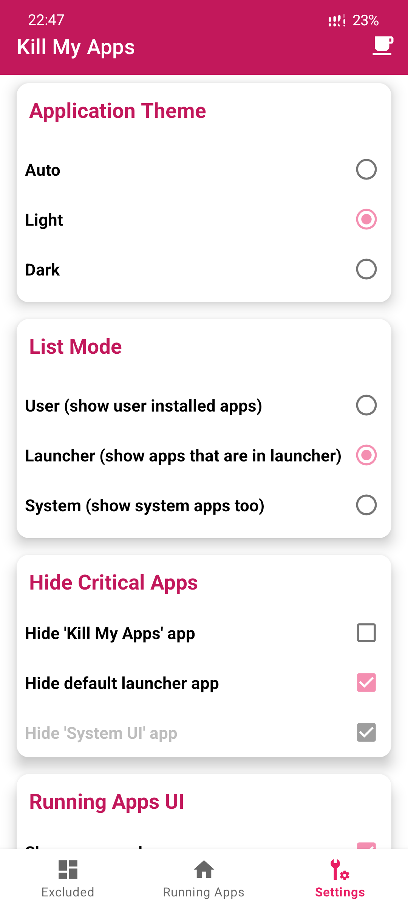
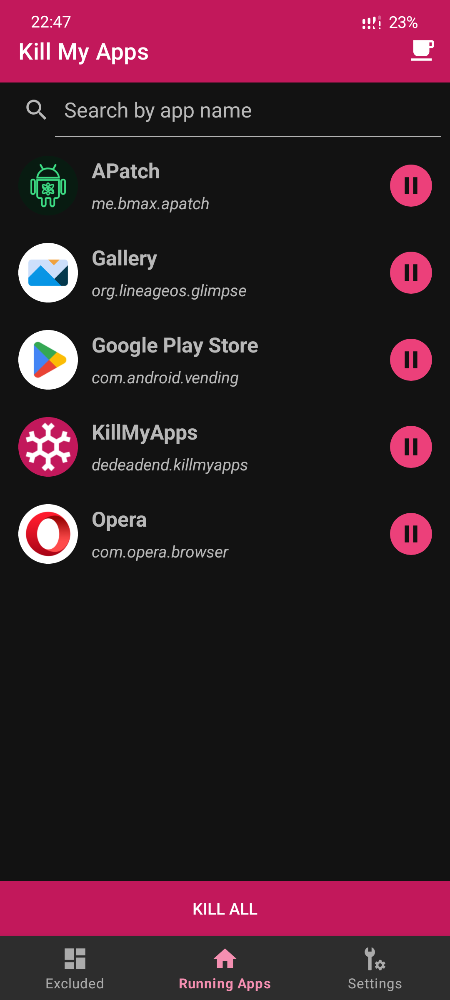

  
  
  
  

# ❄️ Kill My Apps

Kill My Apps is a lightweight utility designed to terminate background processes, helping you **extend battery life**, **boost gaming performance**, and reclaim system resources.

To make the kill function work, [root] permission is necessary. Without it, you can keep using my app, but you have to stop apps manually by touching the target app and selecting "force stop".

## ✨ Features

- ⚡ **One-Click Optimization**: Terminate all background activities instantly.
- 🛡️ **Exclusion List**: Whitelist your important apps to keep them running.
- 🔍 **Smart Filtering**: Categorize apps by User, Launchable, or System processes.
- 🔋 **Battery Saver**: Reduce power consumption by eliminating idle app activities.
- 🎮 **Performance Boost**: Free up RAM and CPU for high-demand tasks like gaming.
- 📱 **Clean UI**: Simple and intuitive Material Design interface.

  ## 📸 Screenshots

| Light | Dark |
|:---:|:---:|
|  |  |

## 📥 Getting Started

#### Prerequisites

- Android 8.0+ "Oreo"
- **Root Access** (Highly recommended for automation)

#### Installation

1. Download the latest APK from the [Releases Page](https://github.com/dedeadend/KillMyApps/releases/latest).
2. Install the APK on your device.
3. Grant Root permissions when prompted for the best experience.
4. Enjoy 💚

## 📌 Note

You might see a Google Play Protect warning while installing the APK. This is common for newly released open-source apps and will be resolved once the app gains more reputation.

## ♠️Support

You can find me at

  

## ❤️ Donation

If you find this project helpful, you can buy me a coffee

  

## ⚖️ License

Distributed under the GPL-3.0 License. See [LICENSE](LICENSE) for more information.

---

  Developed with 💚 by <a href="https://github.com/dedeadend">dedeadend</a>

