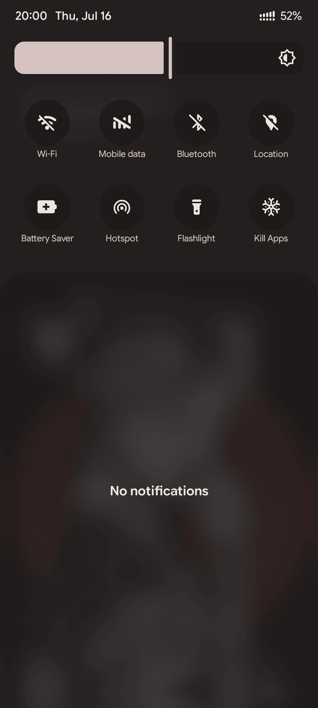

  

  
  
  
  

# ❄️ Kill My Apps

Kill My Apps is a lightweight utility designed to terminate background processes, helping extend battery life, improve gaming performance, and free up system resources. **It also helps reduce intrusive notifications, unwanted background activity, tracking and telemetry**.

> [!IMPORTANT]
> The KILL feature requires **`Root`** or **`Shizuku`** access to operate. Without it, you can still use the app, but you'll need to manually kill running apps by tapping on each one and selecting the Force Stop option. You can change your preferred mode between Root and Shizuku anytime in the app settings.

## ✨ Features

- ⚡ **One-Tap Kill**: Terminate all running apps instantly with a single tap.
- 🫧 **Quick Settings Tile**: Kill running apps directly from your notification panel without even opening the app.
- 🔰 **Killer Mode**: Support Root and Shizuku for an automated app termination process.
- 🛡️ **Source Mode**: Categorize apps by User, Launchable, or System processes, backed by customizable critical app protections.
- 🔎 **Selection Mode**: Flexible app targeting between Exclude and Include modes.
- 🔋 **Save Battery**: Reduce battery usage by stopping unnecessary background activities.
- 🚀 **Boost Performance**: Free up RAM and CPU for high-demand tasks like gaming.
- 🔒 **Enhance Privacy**: Eliminate unnecessary background activity, tracking and telemetry.
- 🍃 **Clean UI**: Simple and intuitive Material Design interface.

  ## 📸 Screenshots

| Dark Theme | Quick Tile | Light Theme |
|:---:|:---:|:---:|
|  |  |  |

## 📥 Getting Started

### Prerequisites

- Android 8.0+ "Oreo"
- **Root** or **Shizuku** to automate the killing process.

### Installation

1. Download the latest APK from the [Releases Page](https://github.com/dedeadend/KillMyApps/releases/latest).
2. Install the APK on your device.
3. Grant `Root`/`Shizuku` permission when prompted for the best experience.
4. Enjoy 💚

> [!NOTE]
> Since KillMyApps is a self-signed APK not distributed via the Google Play Store, Google Play Protect may flag it as "Unknown". As an open-source project, you can always audit the source code yourself or build the APK from source to ensure total transparency.

## ♠️ Support

Have questions or need help? Feel free to reach out:

  
  <!--  -->

## ❤️ Donation

If you find this project helpful, please give it a ⭐

You can also support the development by buying me a coffee:

  

## ⚖️ License

Distributed under the GPL-3.0 License. See [LICENSE](LICENSE) for more information.

---

  Developed with 💚 by <a href="https://github.com/dedeadend">DeDeadend</a>

