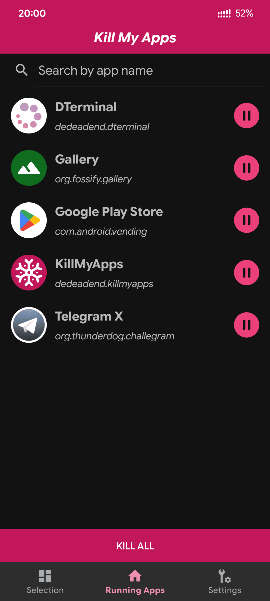
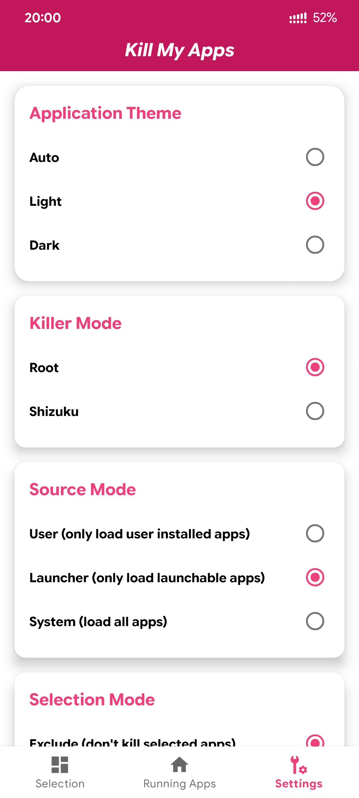

  

  
  
  
  

# ❄️ Kill My Apps

Kill My Apps is a lightweight utility designed to terminate background processes, helping you **extend battery life**, **boost gaming performance** and **reclaim system resources**.

The KILL function requires ROOT permission to operate. Without ROOT, you can continue using the app, but you'll need to manually force-stop apps by tapping on them and selecting the 'FORCE STOP' option.

## ✨ Features

- ⚡ **One-Click Optimization**: Terminate all background activities instantly.
- 🛡️ **Exclusion List**: Whitelist your important apps to keep them running.
- 🔍 **Smart Filtering**: Categorize apps by User, Launchable, or System processes.
- 🔋 **Battery Saver**: Reduce power consumption by eliminating idle app activities.
- 🚀 **Performance Boost**: Free up RAM and CPU for high-demand tasks like gaming.
- 🍃 **Clean UI**: Simple and intuitive Material Design interface.

  ## 📸 Screenshots

| Dark | Light |
|:---:|:---:|
|  |  |

## 📥 Getting Started

### Prerequisites

- Android 8.0+ "Oreo"
- **Root Access** (Highly recommended for automation)

### Installation

1. Download the latest APK from the [Releases Page](https://github.com/dedeadend/KillMyApps/releases/latest).
2. Install the APK on your device.
3. Grant Root permissions when prompted for the best experience.
4. Enjoy 💚

## 📌 Note

Since KillMyApps is a newly released, self-signed APK not yet distributed via the Play Store, Google Play Protect may flag it as "Unknown". As an open-source project, you can always audit the source code yourself or build the APK from source to ensure total transparency.

## ♠️ Support

Have questions or need help? Feel free to reach out:

  
  <!--  -->

## ❤️ Donation

If you find this project helpful, please give it a ⭐

You can also support the development by buying me a coffee:

  

## ⚖️ License

Distributed under the GPL-3.0 License. See [LICENSE](LICENSE) for more information.

---

  Developed with 💚 by <a href="https://github.com/dedeadend">DeDeadend</a>

