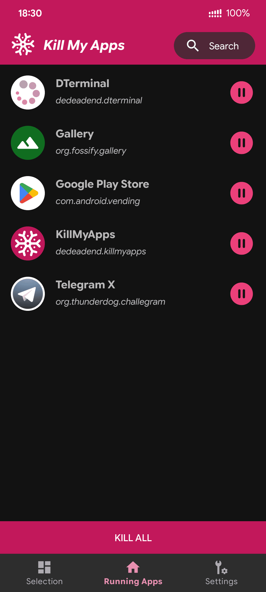
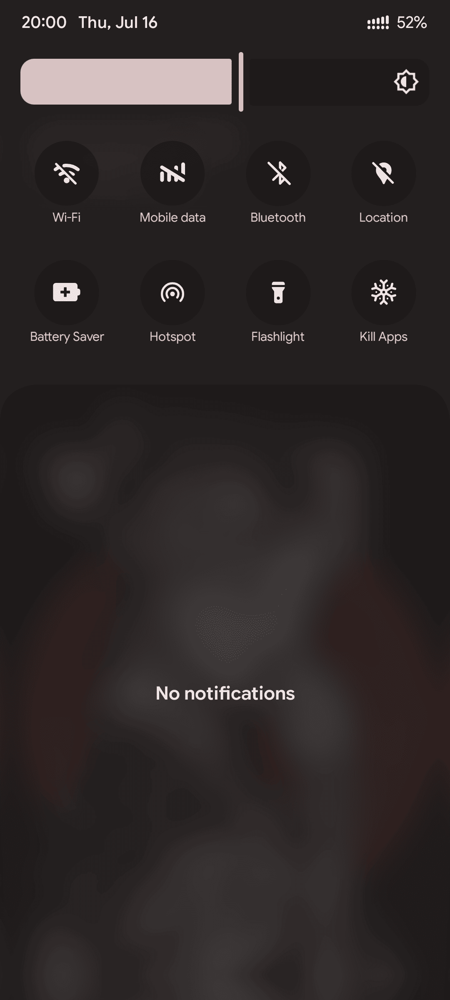
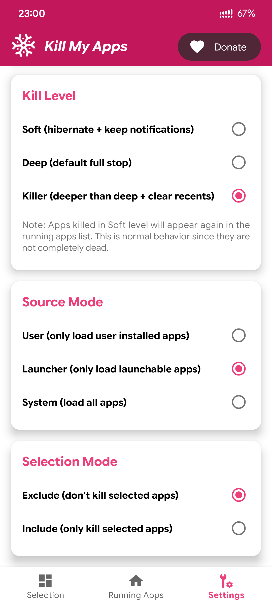

  

  
  
  
  

# ❄️ KillMyApps

KillMyApps is an Android utility for terminating running applications through **Root** or **Shizuku**. It helps extend battery life, improve gaming performance, and free up system resources. **It also helps reduce intrusive notifications, unwanted background activity, tracking and telemetry**.

> [!IMPORTANT]
> The kill feature requires **Root** or **Shizuku** access. Without any of these, Android's standard **Force Stop** action must be used manually for individual applications.

## ✨ Features

- ⚡ **One-Tap Kill**: Terminate running applications with a single action.
- 🔰 **Killer Engine**: Choose between **Root**, **Shizuku** and **Shizuku+** as the execution layer.
- 🔥 **Kill Levels**: Choose between **Soft**, **Deep** and **Killer** levels to control how aggressively applications are terminated.
- 🛡️ **Source Mode**: Filter the running-app list by **User**, **Launchable** or **System** applications.
- 🔎 **Selection Mode**: Control which applications are included in the kill operation using **Include** or **Exclude** mode.
- 🛑 **Hide Critical Apps**: Keep critical applications out of the list by hiding essential system applications, default user apps, and KillMyApps itself.
- ⏰ **Auto Killer**: Automatically terminate running applications when the screen turns off or at a scheduled daily time.
- 🫧 **Quick Settings Tile**: Trigger the kill action directly from Android Quick Settings.
- 🧩 **Home Screen Widgets**: Run the kill action directly from a home screen widget.
- 🔋 **Save Battery**: Reduce unnecessary background activity that can continue consuming battery.
- 🚀 **Improve Performance**: Stop unnecessary background applications to free system resources for resource-intensive tasks such as gaming.
- 🔒 **Privacy**: Reduce unwanted background activity from applications that do not need to remain running.
- 🍃 **Material UI**: A simple and modern interface for managing the kill operation.

## ⚙️ How It Works

KillMyApps displays currently running applications on its main screen. All kill operations are performed only on applications that are present in that list.

The list can be filtered using the available source and selection options:

- **Source Mode** filters the running applications by categories such as **User**, **Launchable** or **System**.
- **Exclude Mode** keeps the selected applications out of the kill operation.
- **Include Mode** limits the kill operation to the applications selected by the user.
- **Hide Critical Apps** removes selected critical applications from the visible list, including essential system applications, default user apps, and KillMyApps itself.

When the kill action is triggered, KillMyApps uses the selected **Killer Engine** to perform the required system-level operation on the running applications that remain within the selected scope.

The selected **Kill Level** controls how aggressively applications are terminated.

## 📸 Screenshots

| Dark Theme | Quick Tile | Light Theme |
|:---:|:---:|:---:|
|  |  |  |

## 📥 Getting Started

### Requirements

- Android 9.0+ (Pie)
- **Root** or **Shizuku** for the kill operation

### Installation

1. Download the latest APK from the [Releases Page](https://github.com/dedeadend/KillMyApps/releases/latest).
2. Install the APK on your Android device.
3. Grant **Root** or **Shizuku** access when requested.
4. Enjoy 💚

> [!NOTE]
> Since KillMyApps is a self-signed APK not distributed via the Google Play Store, Google Play Protect may flag it as "Unknown". As an open-source project, you can always audit the source code yourself or build the APK from source to ensure total transparency.

## ❤️ Donation

If you find this project helpful, please give it a ⭐

You can also support the development through a donation:

  

## 🌐 Stay Connected

KillMyApps is one of the **DeDeadend** projects:

  
  
  
  

## ⚖️ License

Distributed under the GPL-3.0 License. See [LICENSE](LICENSE) for more information.

---

  Developed with 💚 by <a href="https://github.com/dedeadend">DeDeadend</a>

